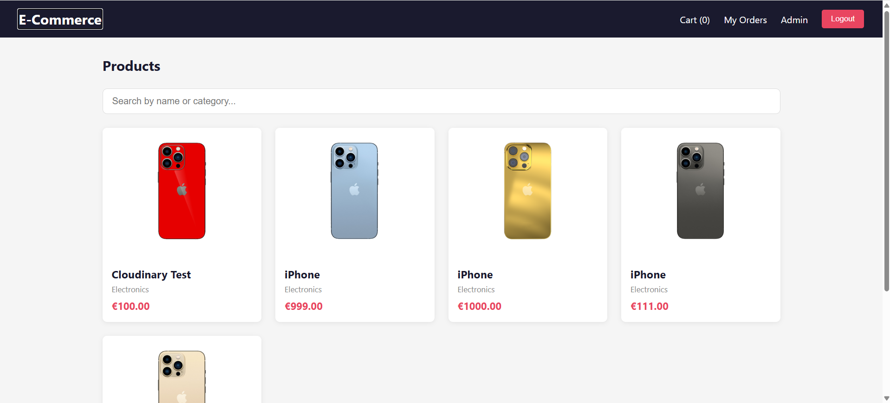
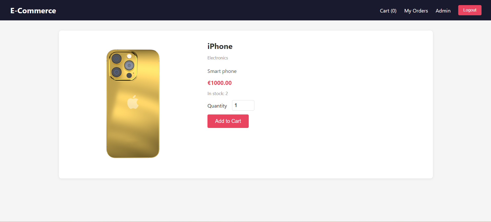
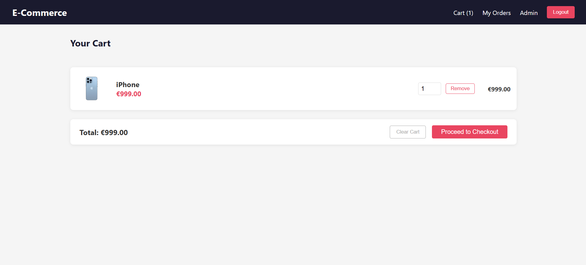
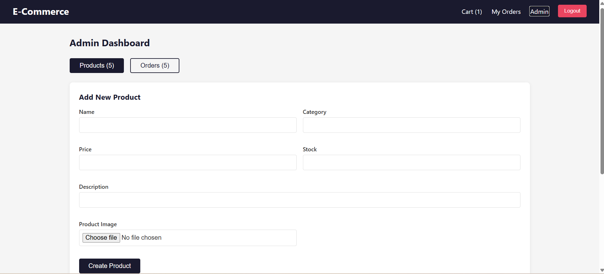
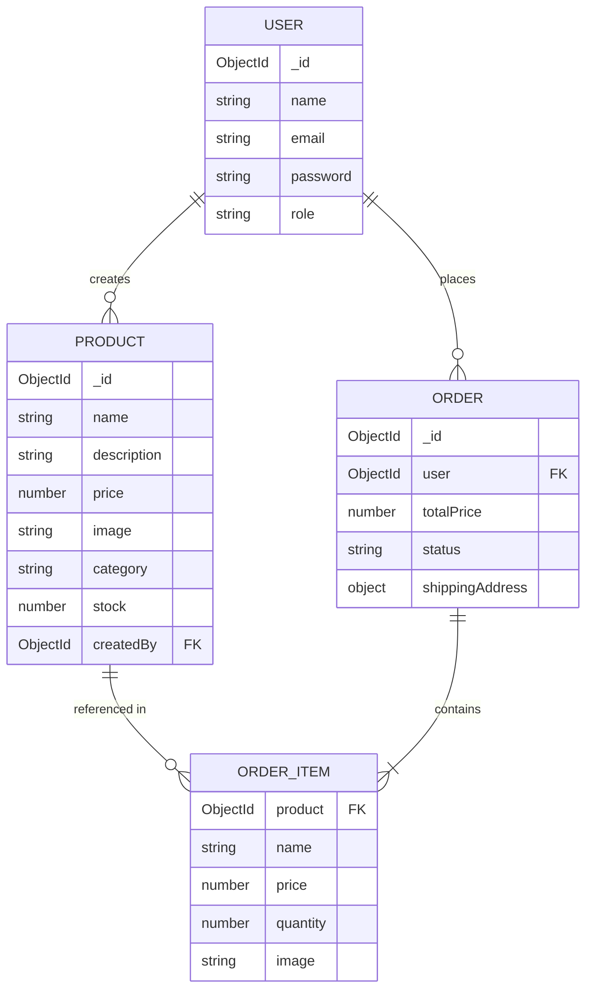

# E-Commerce App

A full-stack e-commerce platform built with Node.js, Express, TypeScript, MongoDB, and React. Features JWT authentication with role-based access control, product management with image uploads, a shopping cart, and a complete order system.

**Live Demo:** [View Live Demo](https://ecommerce-app-six-opal.vercel.app/)

**Repository:** [GitHub](https://github.com/hayderalhatemi/ecommerce-app)

---

## Features

### Backend
- JWT authentication (register/login) with role-based access (`user` / `admin`)
- Product CRUD with image uploads via Multer, stored on Cloudinary
- Order creation, order history, and admin order management
- Request validation with Zod
- Centralized error handling
- Auth and role-restriction middleware
- Security: Helmet + rate limiting
- Versioned REST API (`/api/v1/...`)
- MongoDB Atlas integration via Mongoose

### Frontend
- Redux Toolkit state management (auth + cart, persisted to localStorage)
- Protected routes with role-based access control
- Product browsing with search and filtering
- Shopping cart with quantity updates
- Checkout flow with shipping details
- Order history for users
- Admin dashboard: manage products and update order statuses
- Form validation with React Hook Form
- Toast notifications with react-hot-toast

## Screenshots
A quick overview of the main pages and user interface of the application.

### Home Page



### Product Details



### Shopping Cart



### Admin Dashboard



---

## Tech Stack

**Backend:** Node.js, Express, TypeScript, MongoDB, Mongoose, JWT, Zod, Multer, Cloudinary, Helmet, express-rate-limit

**Deployment:** Render (backend), Vercel (frontend), MongoDB Atlas, Cloudinary

**Frontend:** React, TypeScript, Vite, React Router, Redux Toolkit, Axios, React Hook Form, react-hot-toast

---

## Project Structure

```
ecommerce-app/
├── backend/          # Express API
│   └── src/
│       ├── controllers/
│       ├── middleware/
│       ├── models/
│       ├── routes/
│       └── app.ts
├── frontend/         # React app
│   └── src/
│       ├── api/
│       ├── components/
│       ├── pages/
│       ├── store/
│       └── App.tsx
└── README.md
```

---

## Getting Started

### Prerequisites
- Node.js (v18+)
- MongoDB Atlas account (or local MongoDB instance)

### Backend Setup

```bash
cd backend
npm install
```

Create a `.env` file in `backend/`:

```
PORT=5000
MONGO_URI=your_mongodb_connection_string
JWT_SECRET=your_jwt_secret
CLOUDINARY_CLOUD_NAME=your_cloudinary_cloud_name
CLOUDINARY_API_KEY=your_cloudinary_api_key
CLOUDINARY_API_SECRET=your_cloudinary_api_secret
```

```bash
npm run dev
```

Backend runs on `http://localhost:5000`.

### Frontend Setup

```bash
cd frontend
npm install
```

Create a `.env` file in `frontend/`:

```
VITE_API_URL=http://localhost:5000/api/v1
VITE_API_BASE=http://localhost:5000
```

```bash
npm run dev
```

Frontend runs on `http://localhost:5173`.

---

## API Overview

| Method | Endpoint | Description | Access |
|--------|----------|--------------|--------|
| POST | `/api/v1/auth/register` | Register a new user | Public |
| POST | `/api/v1/auth/login` | Log in | Public |
| GET | `/api/v1/products` | Get all products | Public |
| GET | `/api/v1/products/:id` | Get single product | Public |
| POST | `/api/v1/products` | Create product | Admin |
| PUT | `/api/v1/products/:id` | Update product | Admin |
| DELETE | `/api/v1/products/:id` | Delete product | Admin |
| POST | `/api/v1/orders` | Create order | User |
| GET | `/api/v1/orders/my-orders` | Get user's orders | User |
| GET | `/api/v1/orders` | Get all orders | Admin |
| PATCH | `/api/v1/orders/:id/status` | Update order status | Admin |

---

## API Documentation

Interactive Swagger/OpenAPI documentation:

- **Local:** http://localhost:5000/api-docs
- **Production:** https://ecommerce-backend-mhw5.onrender.com/api-docs

---

## Testing

### Backend
Automated test suite covering authentication, product, and order APIs, using Jest, Supertest, and an in-memory MongoDB instance (`mongodb-memory-server`) for isolated test runs.

```bash
cd backend
npm test
```

**Coverage:** 18 tests across 3 suites — user registration/login, product CRUD with role-based access, and order creation/status updates.

### Frontend
Component and state logic tests using Vitest and React Testing Library.

```bash
cd frontend
npm run test -- --run
```

**Coverage:** 10 tests across 2 suites — cart state management (add/remove/update/clear) and Navbar rendering (auth state, role-based links, cart item count).

---


## Entity Relationship Diagram



---

## Roadmap

- [x] Deploy backend to Render
- [x] Deploy frontend to Vercel
- [x] Cloudinary integration for persistent image storage
- [x] Swagger/OpenAPI documentation
- [x] ERD diagram
- [x] Backend testing (Jest + Supertest)
- [ ] Frontend testing (Vitest + React Testing Library)
- [ ] CI/CD with GitHub Actions

---

## Author

**Hayder Alhatemi**
ICT Student, Turku University of Applied Sciences (TUAS)
[GitHub](https://github.com/hayderalhatemi)

---

## License

This project is for educational and portfolio purposes.
