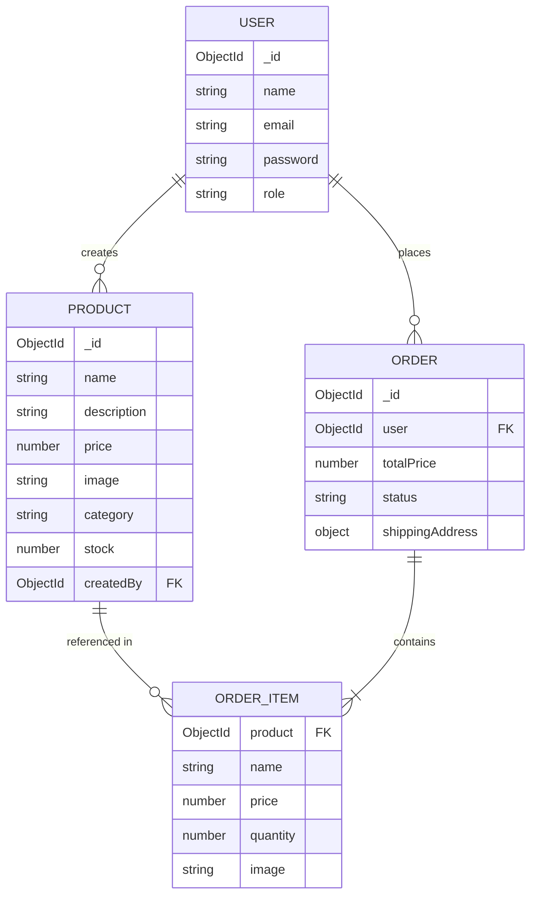

# E-Commerce App


A full-stack e-commerce platform built with Node.js, Express, TypeScript, MongoDB, and React. Features JWT authentication with role-based access control, product management with image uploads, a shopping cart, and a complete order system.

## Live Demo

- **Frontend:** https://ecommerce-app-six-opal.vercel.app/
- **Backend API:** https://ecommerce-backend-mhw5.onrender.com

---

## Features

### Backend

- JWT authentication (register/login) with role-based access (`user` / `admin`)
- Product CRUD with image uploads via Multer, stored on Cloudinary
- Order creation, order history, and admin order management
- Request validation with Zod
- Centralized error handling
- Auth and role-restriction middleware
- Security with Helmet and rate limiting
- Versioned REST API (`/api/v1/...`)
- MongoDB Atlas integration via Mongoose

### Frontend

- Redux Toolkit state management (auth + cart persisted to localStorage)
- Protected routes with role-based access control
- Product browsing with search and filtering
- Shopping cart with quantity updates
- Checkout flow with shipping details
- Order history
- Admin dashboard
- React Hook Form validation
- Toast notifications with react-hot-toast

---

## Screenshots

### Home Page


### Product Details


### Shopping Cart


### Admin Dashboard


---

## Tech Stack

### Backend

- Node.js
- Express
- TypeScript
- MongoDB
- Mongoose
- JWT
- Zod
- Multer
- Cloudinary
- Helmet
- express-rate-limit

### Frontend

- React
- TypeScript
- Vite
- React Router
- Redux Toolkit
- Axios
- React Hook Form
- react-hot-toast

### Deployment

- Vercel
- Render
- MongoDB Atlas
- Cloudinary

### Testing

- Jest
- Supertest
- MongoDB Memory Server
- Vitest
- React Testing Library

### CI

- GitHub Actions

---

## Project Structure

```text
ecommerce-app/
├── .github/
│   └── workflows/
│       ├── backend-ci.yml
│       └── frontend-ci.yml
├── backend/
│   └── src/
├── frontend/
│   └── src/
└── README.md
```

---

## Architecture

```text
React Frontend
      │
      ▼
Axios (HTTP)
      │
      ▼
Express REST API
      │
      ▼
Mongoose
      │
      ▼
MongoDB Atlas
      │
      ▼
Cloudinary
```

---

## Quick Start

### 1. Clone the repository

```bash
git clone https://github.com/hayderalhatemi/ecommerce-app.git
cd ecommerce-app
```

### 2. Backend

```bash
cd backend
npm install
```

Create `backend/.env`

```env
PORT=5000
MONGO_URI=your_mongodb_connection_string
JWT_SECRET=your_jwt_secret
CLOUDINARY_CLOUD_NAME=your_cloudinary_cloud_name
CLOUDINARY_API_KEY=your_cloudinary_api_key
CLOUDINARY_API_SECRET=your_cloudinary_api_secret
```

Run:

```bash
npm run dev
```

### 3. Frontend

```bash
cd frontend
npm install
```

Create `frontend/.env`

```env
VITE_API_URL=http://localhost:5000/api/v1
VITE_API_BASE=http://localhost:5000
```

Run:

```bash
npm run dev
```

Frontend runs on `http://localhost:5173`.

---

## API Overview

| Method | Endpoint | Access |
|---------|----------|--------|
| POST | `/api/v1/auth/register` | Public |
| POST | `/api/v1/auth/login` | Public |
| GET | `/api/v1/products` | Public |
| GET | `/api/v1/products/:id` | Public |
| POST | `/api/v1/products` | Admin |
| PUT | `/api/v1/products/:id` | Admin |
| DELETE | `/api/v1/products/:id` | Admin |
| POST | `/api/v1/orders` | User |
| GET | `/api/v1/orders/my-orders` | User |
| GET | `/api/v1/orders` | Admin |
| PATCH | `/api/v1/orders/:id/status` | Admin |

---

## API Documentation

Interactive Swagger/OpenAPI documentation:

- **Local:** http://localhost:5000/api-docs
- **Production:** https://ecommerce-backend-mhw5.onrender.com/api-docs

---

## Testing

### Backend

Automated API tests using Jest, Supertest, and MongoDB Memory Server.

Run:

```bash
cd backend
npm test
```

Coverage:

```bash
npm test -- --coverage
```

Current coverage includes:

- Authentication API
- Product API
- Order API

### Frontend

Automated component and state management tests using Vitest and React Testing Library.

Run:

```bash
cd frontend
npm run test -- --run
```

Coverage:

```bash
npm run test -- --coverage
```

Current coverage includes:

- Shopping cart state
- Navbar component

---

## Entity Relationship Diagram (ERD)



---

## Roadmap

- [x] Deploy backend to Render
- [x] Deploy frontend to Vercel
- [x] Cloudinary integration for persistent image storage
- [x] Swagger/OpenAPI documentation
- [x] ERD diagram
- [x] Backend testing (Jest + Supertest)
- [x] Frontend testing (Vitest + React Testing Library)
- [x] CI/CD with GitHub Actions

---

## Contributing

Contributions, suggestions, and feedback are welcome. Feel free to open an issue or submit a pull request.

---

## Author

**Hayder Alhatemi**

- GitHub: https://github.com/hayderalhatemi
- LinkedIn: https://www.linkedin.com/in/hayderalhatemi/

---

## License

This project is licensed under the MIT License.